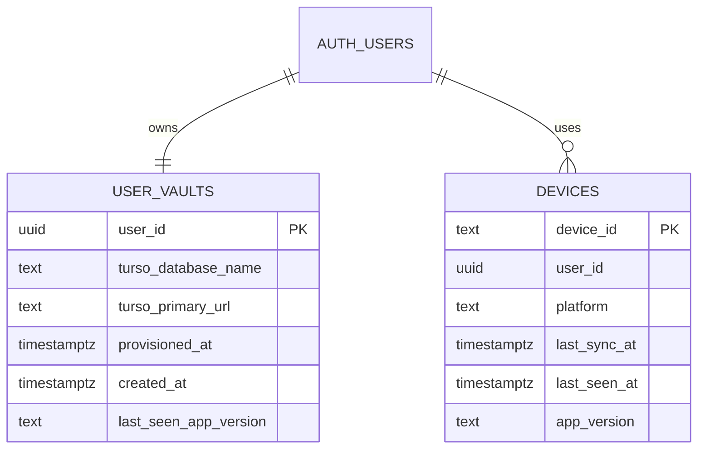

# Replace local file sync with hosted Supabase Auth + Turso sync

> Implementation note (completed 2026-04-22): the shipped solution refined this plan to avoid a risky native-storage rewrite. Kindled now keeps `wa-sqlite` as the local database on every runtime, uses **Supabase email OTP auth** for accounts, provisions a **per-user Turso database** through Supabase Edge Functions, and performs **hosted snapshot reconciliation** between the local database and the user's Turso vault. The old file-sync transport was removed completely.
>
> Delivered:
> - [x] Supabase control-plane schema + deployed `provision-vault` / `get-sync-config` functions
> - [x] Per-user Turso database provisioning and token minting
> - [x] Hosted sync UI/state in the app
> - [x] Local database change tracking + hosted reconciliation engine
> - [x] Removal of deprecated local file-sync modules

## Overview

Replace Kindled’s current user-managed JSON file sync with account-based hosted sync built around **Supabase Auth** for identity and **Turso** for cloud-backed SQLite replication, while preserving Kindled’s local-first product feel on Tauri desktop/mobile.

This plan assumes:

1. **Hosted sync is primarily for Tauri builds first** (iOS, Android, macOS, desktop shell).
2. **SQLite remains the runtime storage model** for user data.
3. **Supabase Postgres is used only as the auth/control plane**, not as the main Kindled content store.
4. **Turso is the data plane** for user content sync.

That assumption matters because the current app owns its database entirely in frontend TypeScript via `wa-sqlite` (`src/db/connection.ts:45`), while Turso’s strongest local-first story fits native/runtime-backed SQLite much better than browser-only `wa-sqlite`.

## Problem Statement

Kindled’s current sync model is intentionally simple but has hit the ceiling of what file-based sync can provide:

- Sync is driven by a manually attached JSON file (`src/sync/file-sync.ts:141`, `src/sync/SyncSettings.tsx:24`).
- The UX is explicit and user-managed rather than account-based (`src/hearth/hearth-view.tsx:308`, `src/ritual/threshold-view.tsx:153`).
- The current pull path imports data via `INSERT OR IGNORE`, which is good for additive merges but weak for updates, deletes, and multi-device conflict handling (`src/sync/file-sync.ts:351`, `src/sync/file-sync.ts:382`, `src/sync/file-sync.ts:406`, `src/sync/file-sync.ts:426`, `src/sync/file-sync.ts:442`).
- Database writes are tightly coupled to file sync because `src/db/connection.ts` calls `schedulePush()` after `exec()` and `run()` (`src/db/connection.ts:4`, `src/db/connection.ts:104`, `src/db/connection.ts:134`).
- The product now wants “sign in and your study data is there” rather than “pick the same file on every device.”

## Why this matters

Hosted sync changes the product in ways users will feel immediately:

- no shared file location setup
- no iCloud/Files/manual picker dependency
- easier multi-device onboarding
- better foundation for future paid accounts, backups, account recovery, and device management
- fewer silent sync footguns than file-based merging

## Proposed Solution

### High-level shape

Adopt a **two-plane architecture**:

1. **Identity + control plane: Supabase**
   - Email magic link / passwordless auth
   - Session management
   - Minimal metadata tables for user-to-vault mapping
   - Edge Functions or equivalent server-side control endpoints for Turso provisioning

2. **Data plane: Turso**
   - One logical Kindled SQLite database per user
   - Local replica/embedded database on Tauri devices
   - Remote sync target for replication
   - Existing Kindled tables (`blocks`, `entities`, `links`, `reflections`, `life_stages`, `schema_meta`) remain the primary content schema (`src/db/schema.ts:6`, `src/db/schema.ts:32`, `src/db/schema.ts:47`, `src/db/schema.ts:60`, `src/db/schema.ts:92`)

### Key product decision

**Use one Turso database per user** rather than a shared multi-tenant content database.

Why this is the best fit for Kindled:

- Kindled data is personal and naturally vault-like.
- The current schema has no `user_id` columns, so per-user DBs avoid a sweeping schema rewrite.
- It preserves the existing mental model: one personal SQLite knowledge base.
- It reduces authorization complexity compared with a shared Turso database without Supabase-native RLS.

### Browser/web scope decision

Hosted sync should be scoped as **Tauri-first** in the first release.

Reason:

- Current persistence is frontend-owned `wa-sqlite` in the web layer (`src/db/connection.ts:45`).
- Turso’s strongest local-first capabilities do not drop directly into the existing browser-only driver.
- Trying to solve native hosted sync *and* browser-local-first sync in one migration materially increases risk.

**Initial posture:**
- Tauri builds: hosted sync path
- Browser static/PWA build: keep local-only/export behavior behind a separate compatibility path until a browser-specific sync story is chosen

## Technical Approach

### Architecture

#### A. Split database access from sync side effects

Today the app’s DB connection triggers sync writes directly via `schedulePush()`.
That coupling has to be removed before hosted sync can be introduced cleanly.

Create a small driver boundary so domain modules keep their existing API shape while the storage implementation can vary by runtime.

Suggested files:

- `src/db/driver.ts` — shared `DatabaseDriver` interface
- `src/db/connection.ts` — runtime driver selection and lifecycle
- `src/db/drivers/wa-sqlite.ts` — existing browser/local implementation extracted from today’s code
- `src/db/drivers/tauri-libsql.ts` — Tauri command-backed implementation for hosted sync
- `src/sync/sync-state.ts` — sync status store, independent from DB write execution

Keep the domain layer mostly intact:

- `src/db/blocks.ts`
- `src/db/entities.ts`
- `src/db/links.ts`
- `src/db/reflections.ts`
- `src/db/ritual.ts`
- `src/db/export.ts`

That keeps the SQL-centric domain model and avoids rewriting all business logic into Rust.

#### B. Move Tauri hosted storage into the native layer

For Tauri, add a native Rust-backed libsql/Turso service and expose a thin command bridge to the frontend.

Suggested files:

- `src-tauri/src/libsql_db.rs` — open local replica, run SQL, manage sync session
- `src-tauri/src/auth_session.rs` — receive/store session state needed by the native layer
- `src-tauri/src/commands/db.rs` — `query`, `run`, `exec`, `transaction` commands
- `src-tauri/src/commands/sync.rs` — sync status, start/stop, force refresh
- `src-tauri/src/lib.rs` — plugin setup + command registration

Frontend TypeScript keeps issuing familiar DB calls; the Tauri driver translates them to native commands.

#### C. Add Supabase auth and vault provisioning

Add an auth module in the frontend and a small control-plane backend.

Suggested files:

- `src/auth/supabase-client.ts`
- `src/auth/session-store.ts`
- `src/auth/auth-flow.ts`
- `src/auth/AuthGate.tsx`
- `supabase/functions/provision-vault/index.ts`
- `supabase/functions/get-sync-config/index.ts`
- `supabase/migrations/20260422_create_user_vaults.sql`

Flow:

1. User signs in via Supabase passwordless email flow.
2. App receives/refreshes session.
3. App calls `provision-vault` once per user.
4. Control plane creates or finds that user’s Turso database.
5. Control plane returns sync config for the device.
6. Tauri native layer opens local replica and begins sync.

#### D. Replace file sync UI with account sync UI

Current UI is file-centric:

- “Create File” / “Browse for File” / “Detach” (`src/sync/SyncSettings.tsx:179`, `src/sync/SyncSettings.tsx:182`, `src/sync/SyncSettings.tsx:197`)

Replace that with account-centric states:

- Sign in
- Syncing
- Synced just now
- Offline changes waiting
- Session expired
- Sign out
- Export backup

Suggested files:

- `src/sync/SyncSettings.tsx` → rename/rework into hosted sync settings
- `src/sync/HostedSyncSettings.tsx`
- `src/sync/HostedSyncSettings.module.css`
- `src/hearth/hearth-view.tsx` — settings menu status copy
- `src/ritual/threshold-view.tsx` — onboarding CTA update

## Schema/Auth Shape

### Supabase control-plane schema

Use Supabase Postgres only for account metadata and provisioning state.

#### `user_vaults`

- `user_id uuid primary key references auth.users(id)`
- `turso_database_name text not null unique`
- `turso_primary_url text not null`
- `provisioned_at timestamptz null`
- `created_at timestamptz not null default now()`
- `last_seen_app_version text null`

#### `devices`

- `device_id text primary key`
- `user_id uuid not null references auth.users(id)`
- `platform text not null`
- `last_sync_at timestamptz null`
- `last_seen_at timestamptz not null default now()`
- `app_version text null`

RLS should protect these control-plane tables because they are still living in Supabase Postgres.

### Kindled content schema in Turso

Keep the existing content tables as the first migration target:

- `blocks`
- `entities`
- `links`
- `reflections`
- `life_stages`
- `schema_meta`

This preserves current export/import, query logic, search, and ritual scheduling behavior.

### Sync metadata additions

Before full rollout, validate whether the app needs extra metadata for deterministic conflict handling.

Candidate additions:

- `device_id` on mutable writes
- `updated_at` on tables that do not already have it (`entities`, `links`, `life_stages`)
- `deleted_at` tombstones where deletion propagation needs explicit semantics
- optional `sync_meta` table for last successful pull/push timestamps and replica info

This is an explicit validation step because the correct choice depends on Turso’s actual multi-device conflict behavior under offline writes.

## ERD

## Implementation Phases

### Phase 1: Prepare the app for pluggable sync

**Goal:** remove direct file-sync coupling from the DB layer without changing user-visible behavior.

#### Tasks

- [ ] Extract current `wa-sqlite` implementation from `src/db/connection.ts` into `src/db/drivers/wa-sqlite.ts`
- [ ] Introduce `src/db/driver.ts` with `query`, `queryOne`, `run`, `exec`, `close`
- [ ] Remove `schedulePush()` imports from `src/db/connection.ts`
- [ ] Move sync notifications into a separate sync coordinator module: `src/sync/sync-state.ts`
- [ ] Keep current file sync working behind a `LegacyFileSyncCoordinator` in `src/sync/legacy-file-sync.ts`
- [ ] Add tests in `src/db/connection.test.ts` and `src/sync/legacy-file-sync.test.ts`

#### Success criteria

- Existing app behavior is unchanged.
- File sync still works.
- DB writes no longer hard-code a specific sync transport.

### Phase 2: Add Supabase auth + control plane

**Goal:** users can sign in and the app can provision/fetch their sync vault.

#### Tasks

- [ ] Add Supabase client module in `src/auth/supabase-client.ts`
- [ ] Build auth/session state in `src/auth/session-store.ts`
- [ ] Add sign-in UI in `src/auth/AuthGate.tsx` and integrate into `src/app/mount-app.ts`
- [ ] Add Tauri deep-link handling for email magic link callbacks in `src-tauri/src/lib.rs` plus any required plugin wiring
- [ ] Add secure token persistence for Tauri session data in `src-tauri/src/auth_session.rs`
- [ ] Create Supabase migration `supabase/migrations/20260422_create_user_vaults.sql`
- [ ] Create `supabase/functions/provision-vault/index.ts`
- [ ] Create `supabase/functions/get-sync-config/index.ts`

#### Success criteria

- User can complete passwordless sign-in on Tauri.
- First sign-in provisions a vault automatically.
- App can fetch the user’s Turso sync configuration after login.

### Phase 3: Add native Turso driver for Tauri

**Goal:** Tauri runtime uses local SQLite backed by Turso sync instead of frontend `wa-sqlite`.

#### Tasks

- [ ] Add libsql/Turso dependency to `src-tauri/Cargo.toml`
- [ ] Implement `src-tauri/src/libsql_db.rs` for local replica open/init
- [ ] Implement Tauri commands in `src-tauri/src/commands/db.rs`
- [ ] Implement TypeScript adapter `src/db/drivers/tauri-libsql.ts`
- [ ] Update `src/db/connection.ts` to select `wa-sqlite` on web and `tauri-libsql` on Tauri
- [ ] Ensure current migration SQL in `src/db/schema.ts` still runs against the new driver
- [ ] Add integration tests in `src-tauri/tests/libsql_db.rs` and `src/db/tauri-driver.test.ts`

#### Success criteria

- Core flows work unchanged against the Tauri driver:
  - capture passage
  - view hearth
  - write reflection
  - create links
  - update ritual state
  - export data

### Phase 4: Hosted sync lifecycle and status model

**Goal:** sync becomes session-aware, background-capable, and account-based.

#### Tasks

- [ ] Create `src/sync/hosted-sync.ts` to manage status and manual refresh hooks
- [ ] Create `src/sync/use-sync-status.ts` for Solid UI bindings
- [ ] Add native sync commands in `src-tauri/src/commands/sync.rs`
- [ ] Model sync states: `signed-out`, `provisioning`, `syncing`, `synced`, `offline-pending`, `error`, `session-expired`
- [ ] Update `src/main.ts` boot flow to wait for auth + sync driver initialization before initial content hydration
- [ ] Add retry/backoff behavior for transient network failures
- [ ] Add token-refresh bridge from `src/auth/session-store.ts` to native sync layer

#### Success criteria

- Offline edits remain local and eventually sync after reconnect.
- Sync status is visible and accurate.
- Expired sessions do not corrupt local state.

### Phase 5: Legacy data migration

**Goal:** existing users move from local/file sync into hosted sync without losing data.

#### Tasks

- [ ] Detect legacy local data from the existing DB on first hosted-sync launch
- [ ] Detect attached legacy file-sync state from `src/sync/file-sync.ts` / stored handles where possible
- [ ] Build one-time migration in `src/migrations/legacy-file-sync-to-hosted.ts`
- [ ] If remote vault is empty, seed it from local data
- [ ] If remote vault is non-empty, run a deterministic merge flow and log the outcome in `src/sync/migration-report.ts`
- [ ] Keep `src/db/export.ts` available as a user-visible backup fallback before migration runs
- [ ] Add migration tests in `src/sync/legacy-migration.test.ts`

#### Success criteria

- Existing local users can upgrade without manual JSON file management.
- Migration is idempotent.
- Users always have an export/backout path.

### Phase 6: UI replacement and rollout

**Goal:** remove file-centric language from product surfaces and ship safely.

#### Tasks

- [ ] Replace `src/sync/SyncSettings.tsx` copy and actions with hosted sync/account states
- [ ] Update settings entry in `src/hearth/hearth-view.tsx`
- [ ] Update threshold CTA in `src/ritual/threshold-view.tsx`
- [ ] Keep exports in `src/db/export.ts` as backup/download tools
- [ ] Gate rollout with `VITE_HOSTED_SYNC_TAURI=1`
- [ ] Keep legacy file sync behind a temporary fallback flag during beta
- [ ] Add telemetry/logging hooks for auth failures, provisioning failures, and sync stalls

#### Success criteria

- Users understand sync as an account feature, not a file feature.
- Beta rollout can be limited to Tauri testers.
- Legacy fallback can be disabled after stability is proven.

## Alternative Approaches Considered

### 1. Supabase full stack (Auth + Postgres + RLS + Realtime)

**Pros**
- Simpler hosted backend story
- Great auth + authorization ergonomics
- Fewer vendors

**Why not chosen**
- Pushes Kindled toward a Postgres-first architecture instead of keeping SQLite local-first
- Would require a larger conceptual rewrite of persistence and offline behavior
- Realtime is not the same as native local-first replication

### 2. Keep file sync and polish the UX

**Pros**
- Smallest code change
- No backend to run

**Why not chosen**
- Does not deliver account-based hosted sync
- Still depends on user-managed storage and permissions
- Still inherits update/delete/conflict limitations of whole-file merge semantics

### 3. Build a custom sync server on top of the current `wa-sqlite` app DB

**Pros**
- Maximum control
- Could preserve the current browser driver

**Why not chosen**
- Much heavier engineering burden than Kindled currently needs
- Reinvents sync/control-plane behavior that Turso already provides
- Increases long-term maintenance cost

## System-Wide Impact

### Interaction Graph

1. **App boot**
   - `src/main.ts` starts the app
   - auth session restores
   - sync config loads
   - Tauri driver opens local replica
   - migrations run from `src/db/schema.ts`
   - hearth/threshold queries execute through existing DB modules

2. **User write path**
   - capture/reflection/link/ritual action calls `src/db/*.ts`
   - driver writes to local SQLite
   - sync coordinator marks local state dirty
   - native layer replicates upstream when possible
   - sync state updates UI in hearth/threshold/settings

3. **Sign-out path**
   - session revoked/cleared
   - sync coordinator stops replication
   - account-only UI hidden
   - local replica policy must decide whether to keep cached content or require explicit local wipe

### Error & Failure Propagation

Expected failure classes:

- Supabase auth callback/deep-link failure
- expired or invalid JWT passed to Turso
- vault provisioning failure
- local replica open/migration failure
- network outage during sync
- partial migration of legacy local data
- token refresh races during active sync

Each should surface as a specific sync/auth state rather than a generic “sync failed” toast.

### State Lifecycle Risks

- **Duplicate vault provisioning** if two devices sign in at the same time for a first-time user
- **Double import** during legacy migration if the app re-runs seeding after partial success
- **Stale tokens** stored in insecure or non-rotating local storage
- **Mixed-driver bugs** if web and Tauri runtimes diverge in SQL behavior
- **Delete semantics** if old import/export assumptions linger in hosted sync code
- **Logout ambiguity** if local data remains cached after sign-out without clear UX

### API Surface Parity

All existing DB consumers should continue to work through the new driver boundary:

- `src/db/blocks.ts`
- `src/db/entities.ts`
- `src/db/links.ts`
- `src/db/reflections.ts`
- `src/db/ritual.ts`
- `src/capture/*`
- `src/hearth/hearth-view.tsx`
- `src/ritual/threshold-view.tsx`
- `src/db/export.ts`

This is critical: auth/sync should not force a rewrite of every UI surface.

### Integration Test Scenarios

- [ ] `src/sync/hosted-sync.e2e.test.ts`: device A creates passages offline, reconnects, device B sees them
- [ ] `src/sync/conflict-resolution.e2e.test.ts`: two devices edit the same reflection offline, then reconnect
- [ ] `src/auth/tauri-magic-link.e2e.test.ts`: magic-link open returns user to the correct Tauri app screen
- [ ] `src/sync/legacy-migration.e2e.test.ts`: existing local/file-sync user upgrades and preserves all five content table types
- [ ] `src/sync/session-refresh.e2e.test.ts`: token expires during sync and recovers without data loss

## Acceptance Criteria

### Functional Requirements

- [ ] Tauri users can sign in with Supabase passwordless auth
- [ ] First sign-in provisions a Turso-backed personal vault automatically
- [ ] Kindled content persists locally and syncs across signed-in Tauri devices
- [ ] Existing core entities remain available after migration: blocks, entities, links, reflections, life stages
- [ ] Legacy file-sync users can migrate without manual JSON attachment after upgrade
- [ ] Export actions in `src/db/export.ts` continue to work as backup/portability features
- [ ] Settings surfaces no longer require “create/browse/detach file” flows for hosted-sync users

### Non-Functional Requirements

- [ ] App remains usable offline after first successful sign-in and initial sync
- [ ] Sync/auth failures are recoverable and user-visible
- [ ] Token handling is stored securely on Tauri runtimes
- [ ] Boot time regression stays within acceptable bounds for opening the local replica and running migrations
- [ ] Migration is idempotent and observable in logs

### Quality Gates

- [ ] Driver boundary covered by automated tests
- [ ] Hosted sync validated on at least macOS + iOS or Android before broad rollout
- [ ] Multi-device sync tested with concurrent edit scenarios
- [ ] Auth callback/deep-link behavior documented per platform
- [ ] Rollback path exists via export + feature flag fallback

## Success Metrics

- >80% of active Tauri users complete sync setup without support intervention
- median time from install to first synced device under 3 minutes
- sync failure rate below 1% of active sessions after beta hardening
- migration success rate above 99% for users with legacy local data
- support burden for “which file do I pick?” effectively eliminated

## Dependencies & Prerequisites

- Supabase project with passwordless auth configured
- Turso account/project with database provisioning strategy defined
- Secure secret handling for provisioning/admin credentials
- Tauri deep-link strategy confirmed for passwordless callbacks
- Native secure storage strategy selected for session persistence
- Clear decision on whether browser/PWA remains supported during phase 1 rollout

## Risk Analysis & Mitigation

| Risk | Impact | Mitigation |
|---|---|---|
| Turso native integration requires more rewrite than expected | High | Spike Phase 3 before deleting legacy sync |
| Tauri magic-link callbacks are flaky on mobile | High | Validate deep-link flow early; fall back to OTP code if required |
| One-DB-per-user becomes operationally awkward | Medium | Validate quotas and provisioning workflow before beta |
| Web build cannot share hosted-sync implementation | Medium | Explicitly scope hosted sync to Tauri first |
| Legacy migration duplicates or loses data | High | Make migration idempotent; force export backup before commit |
| Session/token persistence is insecure | High | Use native secure storage, not plain frontend localStorage |

## Resource Requirements

- 1 engineer for storage/runtime refactor
- 1 engineer or focused block for auth/provisioning/control plane
- real-device test coverage on at least two Tauri platforms
- Supabase + Turso staging environments

## Future Considerations

- browser-hosted sync path after Tauri rollout stabilizes
- account deletion and full remote wipe
- device list management UI
- paid sync tiers or backups
- collaborative or shared study spaces (would likely require a different multi-tenant data model)

## Documentation Plan

- [ ] Update `README.md` to explain hosted sync vs local export behavior
- [ ] Add `docs/architecture/hosted-sync.md` describing auth/control plane + Turso data plane
- [ ] Add `docs/runbooks/hosted-sync-debugging.md` for auth, provisioning, and replica failures
- [ ] Add platform setup notes for deep links and Supabase redirect URLs
- [ ] Add migration notes for legacy file-sync users

## Sources & References

### Internal References

- Current frontend-owned SQLite connection: `src/db/connection.ts:45`
- Current DB write → file sync coupling: `src/db/connection.ts:4`, `src/db/connection.ts:104`, `src/db/connection.ts:134`
- Current file sync lifecycle: `src/sync/file-sync.ts:141`, `src/sync/file-sync.ts:178`, `src/sync/file-sync.ts:193`, `src/sync/file-sync.ts:253`, `src/sync/file-sync.ts:295`, `src/sync/file-sync.ts:341`
- Current additive import semantics: `src/sync/file-sync.ts:351`, `src/sync/file-sync.ts:382`, `src/sync/file-sync.ts:406`, `src/sync/file-sync.ts:426`, `src/sync/file-sync.ts:442`
- Current sync UI: `src/sync/SyncSettings.tsx:24`, `src/sync/SyncSettings.tsx:179`, `src/sync/SyncSettings.tsx:182`, `src/sync/SyncSettings.tsx:197`
- Current sync entry points in product UI: `src/hearth/hearth-view.tsx:308`, `src/hearth/hearth-view.tsx:439`, `src/ritual/threshold-view.tsx:39`, `src/ritual/threshold-view.tsx:97`, `src/ritual/threshold-view.tsx:153`
- Current content schema: `src/db/schema.ts:6`, `src/db/schema.ts:32`, `src/db/schema.ts:47`, `src/db/schema.ts:60`, `src/db/schema.ts:92`
- Current content types: `src/db/types.ts:22`, `src/db/types.ts:41`, `src/db/types.ts:54`, `src/db/types.ts:66`, `src/db/types.ts:74`
- Current export surface to preserve: `src/db/export.ts:6`, `src/db/export.ts:27`, `src/db/export.ts:328`

### External References

- Supabase Row Level Security overview: https://supabase.com/features/row-level-security
- Supabase Postgres RLS guide: https://supabase.com/docs/guides/database/postgres/row-level-security
- Supabase passwordless auth guide: https://supabase.com/docs/guides/auth/auth-email-passwordless
- Turso embedded replicas introduction: https://docs.turso.tech/features/embedded-replicas/introduction
- Turso sync usage: https://docs.turso.tech/sync/usage
- Turso authentication/JWKS docs: https://docs.turso.tech/sdk/authentication
- Turso Sync announcement/background: https://turso.tech/blog/introducing-databases-anywhere-with-turso-sync

### Research Notes

- No relevant local brainstorm document found in `docs/brainstorms/`.
- No existing `docs/solutions/` learnings were present in this repo at planning time.

## Open Questions

- Should browser/PWA remain supported during the first hosted-sync rollout, or be explicitly local-only?
- Do we want magic links specifically, or email OTP as a more resilient mobile fallback?
- Is one Turso database per user acceptable operationally for the expected scale of Kindled?
- Do we need explicit tombstones/`updated_at` metadata beyond what Turso replication already guarantees?
- On sign-out, should local content remain available offline or be cleared by default?
